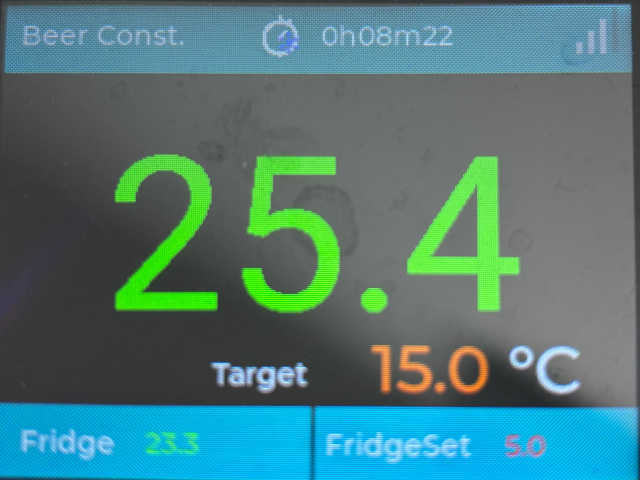
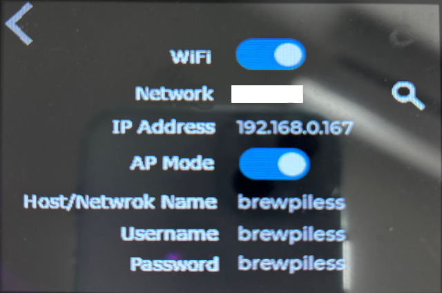
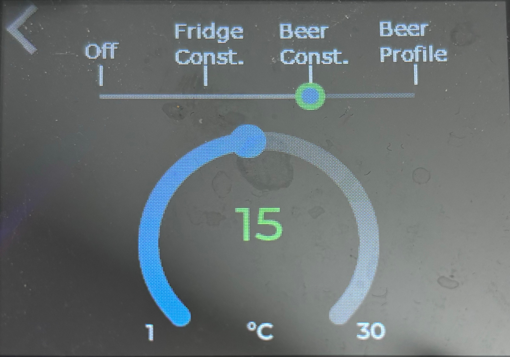
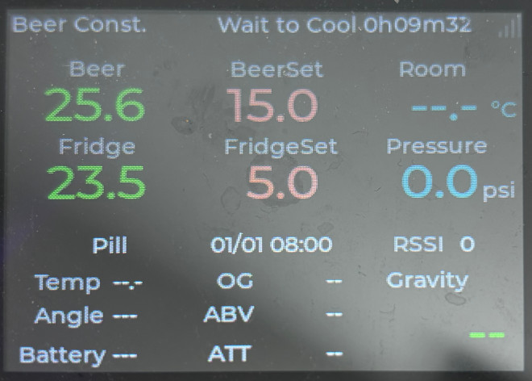
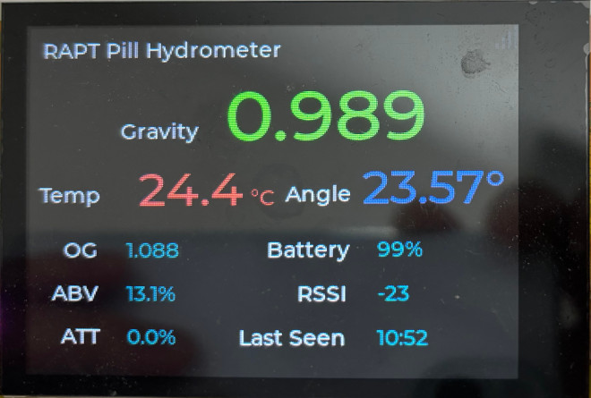

# BrewPiLessGx

BrewPiLessGx is [BrewPiLess](https://github.com/vitotai/BrewPiLess) running on ESP32_2432S032C, which is a ESP32 with a touch enabled TFT. Built on top of [lvgl](https://lvgl.io), flexbile display and touch based GUI are implemented.

The main display is defined by [JSON format](doc/skin.md). There is a developing [tool](https://www.vito.tw/BrewPiLessGx/extra/SkinEditor) to help compiling the JSON file.
# Known Issue:
- BLE stops working. The controller might crash when scanning is triggered.
    -  It's a fixed bug in newer framework, but [another bug]( https://github.com/espressif/arduino-esp32/issues/8976) stop me from upgrading.

# Update Note
- 2024/10/11
    - Using lv_obj_t to draw circles instead of canvas drawing. Canvas drawing is too CPU intensive.
- 2024/10/01
    - Automatic go back to main screen when staying idle for 30 seconds in Temperature control screen.
    - update Interface editor.
- 2024/09/28
    - create screens when needed and release when leaving.
    - Default no password for AP mode, workaround for [this issue]( https://github.com/espressif/arduino-esp32/issues/8976)
    - Add back temperature correction option for gravity device. Pill without correction works better for me.
    - Add LCD backlight adjustment. Valid range: 100-255. 
    - change gamma curve setting for ESP32_2432S032C

- 2024/09/15
    - Include AsyncElegantOTA library.
    - Set temperature default value to 20C/68F.
    - Skin Editor now has touch area settings, and icon representation of stat can be used.
- 2024/06/10
    - Bluetooth/BLE themometer(BTHome, ATC1441, and PVVX) support. (Default disable because it rises the chance of a known bug.)
    - Display gravity changes(decreasing) in 24H/12H/6H 
- 2024/05/24
    - OTA support for 8M+ devices by using http://[ip or brewpiless.local]/update
    - Update Skin Editor
- 2024/05/04
    - WT_SC01Plus configuration
    - screen saver issue
    - use custom function for lv_mem_alloc/free
- 2024/04/14
    - Add Parasite(Glycol) temperature control display
    - Add Humidity sensor/control option
    - fix time period dipslay bug
- 2024/03/28
    - revise (Network) Setting and (Temperature) Control screen so that even they can be used on 480x320 LCD
    - use "list" instead of "table" to display Network list.
    - Wireless Sensor issue solution from BrewPiLess.

- 2024/03/24
    - reorgnize source structure to make it easier for hardware adpation.
    - LovyanGFX driver integration

- 2024/03/20
    - Make Generic display drivers, ArduinoGFX, default configuration.
    - Add wakeup button(boot button) to ESP32_17320S019N

# Feature

- TFT with touch enabled
    - Set control mode and temperature on the screen.
    - Select and connect Network on the screen.
- Customized display. Display information you need.
    - Two built-in skin available. one for simple BrewPi information, and the other have all available information.
    - It can be configured to show only hydrometer information, thus used as a iSpindel, Pill ,or Tilt reapeater.

## Bluetooth/BLE Themometer/humidity Sensor

BTHome, ATC1441, and Pvvx Custom format are supported, whilt ATC1441 and Pvvx work better than BTHome.

https://github.com/pvvx/ATC_MiThermometer

Given the fact that the information is not broadcasted all the time, scanning might fail once or more times. If the BLE thermometer is
to be used as chamber thermometer, ATC1441 and PVVX might be better choices. My Mi Thermometer set to broadcast in BTHome format broadcast battery status alternatively, which results in no reception of temperature reading over a minute. 

# Screen
The UI screens
- Main infomraton screen
- Temperature Control
    to set control mode and temperature.
- Network Settings
    to view current settings, to enable/disable AP mode, an to connect to a WiFi network.

# Hardware
## Smart Display 24320S032C
The hardware is a 3.2" smart display type 24320S032C, bought from [Aliexpress](https://www.aliexpress.com/item/1005005138982767.html).

- 240x320 16bit TFT, driven by ILI9431
- Capative touch, GT911 based.
- Three hardware pins available, they are
    - 22: OneWire for DS18B20
    - 21: actuator. Cooling/Heating
    - 35: Pressure transducer

If more actuators are needed, DS2413 based one-wire relays might be an option.

Most functionalities of BrewPiLess are supported, but due to limitation of the hardware not all of them are available.

## ESP32_17320S019N
ESP32_17320S019N is an ESP32-S3 based device with 1.9 inch TFT 320x170 display. It's tiny and cute, but it doesn't has a touch panel. To wake up it from screen saving(display off) mode, push "Boot" button.
( I bought this as my first ESP32-S3 platform for cheap. It is only for testing/verifying purpose.)

## WT-SC01 Plus
- 320x480 16bit TFT, driven by ST7796UI
- Capative touch, FT6336U driver
- 6 hardware pins available, they are
    - 10: ADC for Pressure transducer
    - 11: OneWire, temperature sensors
    - 12, 13, 14, 21: actuators

It's tricky to work with the WT-SC01 Plus. Short GPIO 0(pin 6 of debug port) and Ground(pin 7 of debug port) **might** put the device in download mode. At least, it works for me at least one in three times. My device stays in **download mode** afte flashing. Press of the rest button in the back will result in normal boot-up.

# Custom Hardware
There are so many difference hardware configurations that I can make it to support all of them. Even with the same driver IC, there might be different configurations. Without verification with the real devices, I won't declare that it is supported. The adpation is not diffucult if you can find the drivers for your hardware.

`/src/driver` has all the files to support custom hardware.

### Preparing
Find out the pin usages/connections of your hardware. Give your platform a name. You will need a macro to seperate your definition from others.

### /src/driver/pindef.h
The pin definition is isolated from legacy `brewpi/Config.h`. Usually, at least two PINs are needed to make BrewPiLessGx work as a temperature controller: `oneWirePin` for temperature sensors and `actuatorPin1` for cooling or heating control. If there are more free PINs available, up to `actuatorPin6` can be defined. Don't define PINs that is not available/free.

`PressureAdcPin` is for pressure trasductor, only PINs supports ADC(Analog to Digial Conversion) can be used. Add `-DSupportPressureTransducer=false` in `platformio.ini` if you don't use it.

ADC2 is also used for WiFi and should be avoided. For ESP32S3, use GPIO1 ~ GPIO10, and GPIO32 ~ GPIO39 for ESP32, if available.

### /src/driver/lv_drv_conf.h
This file defines screen Width and Height as well as the draw buffer size. Usually, only width and height will be changed. We are running out of memory, so don't oversize the buffer.

### /src/driver/driver_if.h
This file defines all functions needed for LVGL. The porting/adaption is to implement those functions.

### Adapton of the driver, with LovyanGFX
LovyanGFX has a good collection of TFT and touch panel drivers. You might find your platform is supported. Change the include path to your platform. 

If you don't have the luck, you might still be able to adpat LGFX to support your platform. Check LovyanGFX on github for more information. The platform 'ESP32_2432S032C_lgfx' is an example for reference.

### Adapton of the driver, with ArduinoGFX
ArduinoGFX supports many TFT drivers. Hoever, it doesn't include touch panel drivers. Check 'ESP32_2432S032C' for reference.

# Difference between BrewPiLess

- OTA via AsyncElegantOTA library for 8M+ devices.
    - http://[ip or brewpiless.local]/update
- the filemanager is access at standard port
- NO traditional I2C LCD support

# Operation
The main display is customizable, defined by a JSON file. The syntax and format is described in the [document](doc/skin.md). There is a not-so-good UI designer in "extra/SkinEditor".

There are two built-in skins. The first one is "brewpi" for who just use traditional BrewPi functionality. 

To access network control, tap the bars of wireless icons at the right top corner to bring this screen. Information of network settings are shown. Basic control, including select a WiFi network, are available. Guessing the IP address is no longer necessary.

To setup control mode and target temperature, tap the "Target" string. 

.

The second built-in skin provides all available information of BrewPiLess.

Tap the same wireless icon for accessing network settings, and the area of BeerTemp, BeeerSet, FridgeTemp, and FridgeSet for Temperature control.

To input Original Gravity, tap the area of OG, ATT, and ABV. To input current gravity, tap around the gravity.

The main screen and tapping area are all customizable. For example, display only information of Pill to serve as a Pill gateway is possible.

