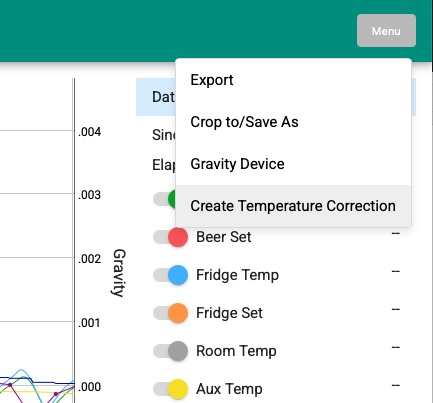
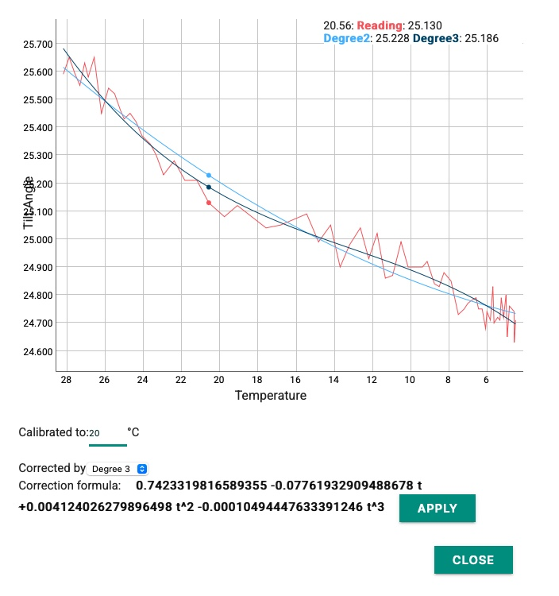
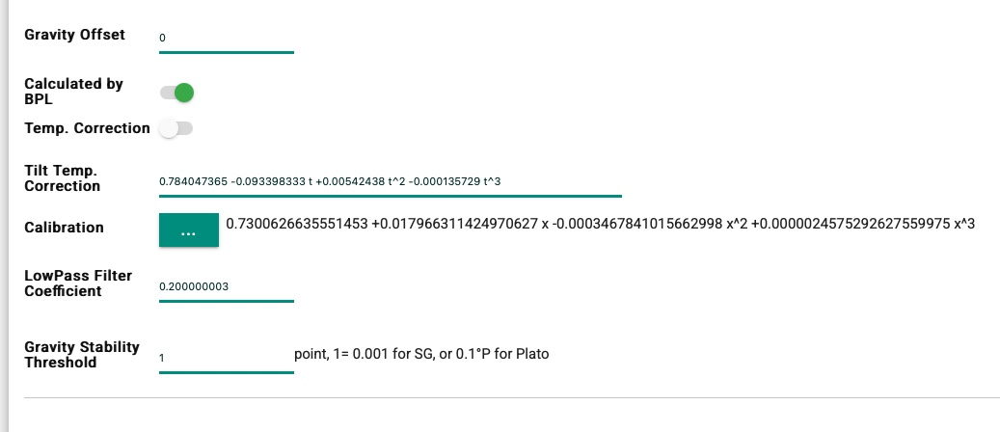

# How to Work with Temperature Correction

The new temperature correction feature is experimental. Please use it with care. To disable it, set the **"Tilt Temp. Correction"** in the Gravity settings to **0**. The correction data will be recorded in logs, and it can be modified or deleted.

## Get the correction formula

The first step is to collect data for correction. The "Record Angle/Raw" option in LOGS must be enabled before starting to save logs.

Place the wireless hydrometer in water and slowly cold crash. Record the log with raw tilt angles.
Alternatively, find a log from a cold crash after the final gravity (FG) is stable—where gravity remains unchanged, but the temperature varies.
Open the log using the latest BPLLogViewer and select a region where the actual gravity does not change, but the temperature does. Click "Create Temperature Correction" to generate the correction formula. You can choose a polynomial degree of 2 or 3. The calibration temperature should ideally match the temperature at which you calibrated your Pill/iSpindel for gravity calculations. You can also apply the correction to an existing log to see how it works.

## Applying the correction formula

Copy the generated formula into the **Gravity** settings, and you're all set.

The correction formula can also be written into an existing log using BPLLogViewer. Simply copy the formula, open the log, paste it into the "Gravity Device" information, and then use "Crop to/Save As" to create a new file.