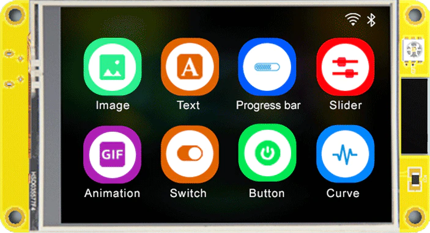
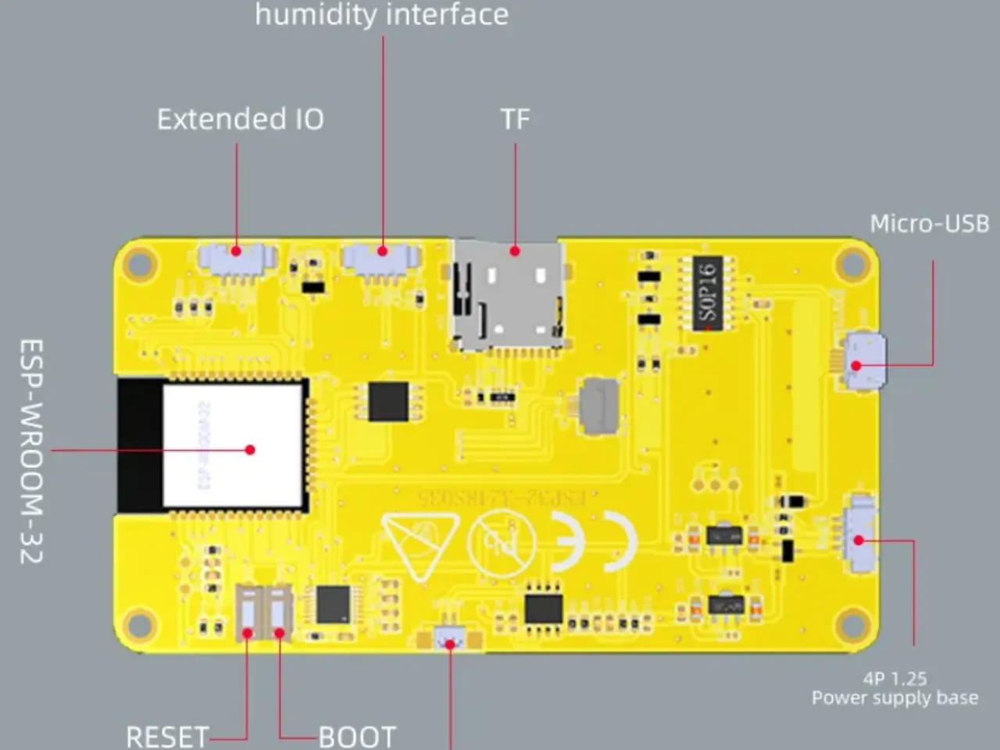

# ESP32-SmartDisplay

[](https://github.com/rzeldent/esp32-smartdisplay/actions/workflows/main.yml)

## LVGL drivers and peripheral interface for Chinese Sunton Smart display boards 2432S024R/C/N, 2432S028R, 3248S035R/C and 8048S070N/C

This library supports these boards without any effort.

## Why this library

With the boards, there is a link supplied and there are a lot of examples present and this looks fine.
These examples for [LVGL](https://lvgl.io/) depend on external libraries ([TFT_eSPI](https://github.com/Bodmer/TFT_eSPI) or [LovyanGFX](https://github.com/lovyan03/LovyanGFX)).
However, when implementing the capacitive version, I found out that these libraries had their flaws using these boards.
Additionally, There was a log of unnecessary code included in these libraries.
There is also a library for [LVGL](https://lvgl.io/) present [LVGL_ESP32_drivers](https://github.com/lvgl/lvgl_esp32_drivers) but this is not aimed at the Arduino framework but ESP-IDF framework.

## Where and why buying these boards

These boards are available on AliExpress for decent prices and offer a lot.
They can be bought in the [Sunton Store](https://www.aliexpress.com/store/1100192306) on AliExpress but saw them also from other sellers.

- [ESP32-2432S024R/C/N - 2.4" 240x320 TFT Resistive/Capacitive touch/No touch](https://www.aliexpress.com/item/1005005865107357.html)
- [ESP32-2432S028R - 2.8" 240x320 TFT Resistive touch](https://www.aliexpress.com/item/1005004502250619.html)
- [ESP32-3248S035R/C 3.5" 320x480 TFT Resistive/Capacitive touch](https://www.aliexpress.com/item/1005004632953455.html)
- [ESP32-8048S070C/N - 7.0" 800x480 TFT Capacitive touch/No touch](https://www.aliexpress.us/item/1005004952726089.html)




These boards offer:

- ESP32-WROOM,
- 4MB Additional Flash,
- Display with touch (IL9341/ST7796 and XPT2046/GT911),
- Light sensor (CDS),
- Audio amplifier,
- RGB led (3.5" front, 2.8" back),
- Extension connectors,
- USB Serial interface,
- Expansion connectors,
- Power connector,
- 4 Holes so can easily be attached,
- ...

## Dependencies

This library depends on some standard libraries to access the SPI and I2C busses:

- SPI (version ^2.0.0)
- Wire (version ^2.0.0) when using capacitive touch

To have all the constants and prototypes from LVGL, the LVGL library is already included.:

- LVGL (version ^8.3.2)

To use the LVGL library, a `lv_conf.h` file is required to define the settings for LVGL.
This file needs to be provided by the application.
As this file is referenced from the build of LVGL, the path must be known.
Normally this file is included in the include directory of your project so the define must be

```ini
    -D LV_CONF_PATH=${PROJECT_INCLUDE_DIR}/lv_conf.h
```

The template for the `lv_conf.h` file can be found in the LVGL library at `.pio/libdeps/esp32dev/lvgl/lv_conf_template.h`.

## How to use

Basically there is only **ONE** define that need to be defined: The type of board assuming everything is default.

- Type of board (required)

  - ESP32_2432S024R
  - ESP32_2432S024C
  - ESP32_2432S024N
  - ESP32_2432S028R
  - ESP32_3248S035R
  - ESP32_3248S035C
  - ESP32_8048S070N
  - ESP32_8048S070C

- Orientation of the board (optional)

  - TFT_ORIENTATION_PORTRAIT (default)
  - TFT_ORIENTATION_LANDSCAPE (rotated 90 degrees)
  - TFT_ORIENTATION_PORTRAIT_INV (rotated 180 degrees)
  - TFT_ORIENTATION_LANDSCAPE_INV (rotated 270/-90 degrees)

- Flipped/Mirrored (optional)
  Some TFT batches seem to have the contents mirrored and flipped.
  The flag TFT_FLIPPEDMIRRORED compensates for this (production?) anomaly.

- LCD Panel RGB order (if red and blue are swapped on the display, optional)
  - TFT_PANEL_ORDER_RGB
  - TFT_PANEL_ORDER_BGR (default)

These can be defined in the `platformio.ini` file defining the settings:

```ini
build_flags =
    # LVGL settings
    -D LV_CONF_PATH=${PROJECT_INCLUDE_DIR}/lv_conf.h
    # Smart display settings
    #-D TFT_PANEL_ORDER_BGR
    #-D TFT_PANEL_ORDER_RGB
    #-D TFT_ORIENTATION_PORTRAIT
    #-D TFT_ORIENTATION_LANDSCAPE
    #-D TFT_ORIENTATION_PORTRAIT_INV
    #-D TFT_ORIENTATION_LANDSCAPE_INV
    #-D TFT_FLIPPEDMIRRORED
    #-D ESP32_2432S024N
    #-D ESP32_2432S024R
    #-D ESP32_2432S024C
    #-D ESP32_2432S028R
    #-D ESP32_3248S035R
    #-D ESP32_3248S035C
    #-D ESP32_8048S070N
    #-D ESP32_8048S070C

lib_deps =
    rzeldent/esp32_smartdisplay@^1.0.9
```

The path for the lv_conf.h above is `${PROJECT_INCLUDE_DIR}`.
This needs to be specified because the LVGL library included this header file.

## Demo application

An bare minimum application to demonstrate the library can be found at [esp32-smartdisplay-demo](https://github.com/rzeldent/esp32-smartdisplay-demo).

## Functions

### std::recursive_mutex lvgl_mutex

This mutex is defined to limit the access to lvgl functions to one thread.
When used in multiple threads, this corrupts the display and/or state of LVGL

Use like this:

```c++
const std::lock_guard<std::recursive_mutex> lock(lvgl_mutex);
```

During the scope of this variable, the mutex is locked. This will allow only one thread or section to use lvgl.

### void smartdisplay_init()

Initialize the display and touch.
This is the first function that needs to be called.
It initializes the display controller and touch controller.

### void smartdisplay_set_led_color(lv_color32_t rgb)

Set the color of the led. The led has 3 channels: R(ed), G(reen) and B(lue).
Each channel has a 8 bit resolution so from 0-255.

The lv_colo32_t can be set in the following manner:

```c++
lv_color32_t({.ch = {.green = 0xFF}}) : lv_color32_t({.ch = {.red = 0xFF}})
```

### int smartdisplay_get_light_intensity()

Get the value of the CDS sensor.
The sensor measures the (ambient) light level and can be used to adjust the brightness of the display.

### void smartdisplay_beep(unsigned int frequency, unsigned long duration)

Beep with the specified frequency and duration. To hear the sound a 8 ohms speaker must be connected.

### void smartdisplay_tft_set_backlight(uint16_t duty)

Set the brightness of the backlight display. The resolution is 12 bit so 0-1023.

### void smartdisplay_tft_sleep()

Put the display to sleep.

### void smartdisplay_tft_wake()

Wake the display.

## Version history

- October 2023
  - Added option for flipped/mirrored TFT's
  - Changed default RGB order to BGR
  - Version 1.0.8 and 1.0.9
- September 2023
  - Added support for ESP32_2432S024N/R/S
  - Version 1.0.7
- August 2023
  - Added support for esp32_8048S070N/S
  - Display buffer size configurable
- February 2023
  - Version 1.0.3
  - Added variable for the LCD panel RGB/BGR order
- February 2023
  - Version 1.0.3
  - Added mutex for access to lvgl, required for multithreading
  - Changed RGB led input to lv_color32_t
- December 2022
  - Initial version 1.0.2.
  - Drivers for ESP32_2432S028R, ESP32_3248S035R and ESP32_3248S035C displays working.
  - Sound output
  - RGB Led output
  - CDS light sensor input
- July 2022
  - Initial work started